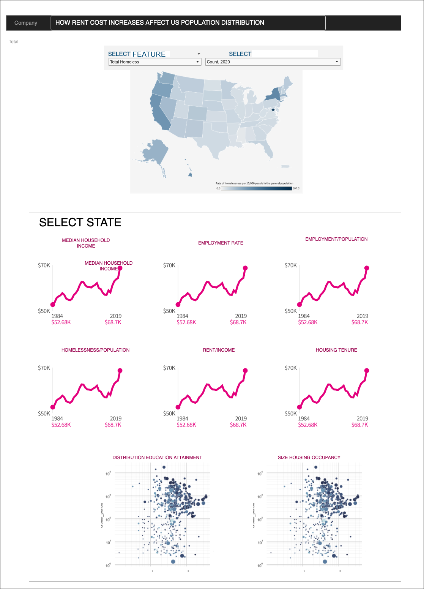

# RENTAL COSTS ON THE RISE

Team 120: Jenelle Allen, [Nancy Beard](https://www.linkedin.com/in/nancy-beard-96872b37), Orpa Jackson, [Wildo Acosta](linkedin.com/in/wildo-acosta-quiñones-86215484), [Ali Lara](https://www.linkedin.com/in/aliglara)

## Business Problem

Many Americans today have chosen to rent housing vs. buying. Some of their choices are no maintenance costs to cover, no real estate taxes to pay, access to complimentary amenities, or even more flexibility if the renter decides to relocate. Rental properties were forced to lock in on current rental rates during the pandemic. However, now that Americans are returning to normalcy, rental rates have risen.

Typically, the highest rent increase was about 3% in the past. However, America is seeing at least an 11% increase from a year earlier, with some larger cities showing 30-40% increases. Unfortunately, the average renter's income is not increasing at these same rates, causing renters to become homeless. Even though many homeless people might be employed, they just cannot afford housing.

Our goal is to create a data-driven tool that will demonstrate whether there is a link between rising rent and homelessness in the United States.

## Business Impact

Homelessness has a massive impact on the health and well-being of families nationwide. Among numerous health issues, homeless people are exposed to more outside elements -- hot, cold, rain, snow, hurricanes,
tornados, which increase the likelihood of getting sickness, injury, or disease can spread. 

Additionally, [Bridges](https://journals.sagepub.com/doi/abs/10.1177/00111287221087957) (2022) has reported a strong correlation between homelessness and crime, which does not necessarily mean that homeless people cause offense. But due to harsh living conditions and a lack of defending themselves, they are vulnerable to hate crime.

Finally, [Ventriglio et al.](https://www.google.com/books/edition/Homelessness_and_Mental_Health/4_hQEAAAQBAJ?hl=en&gbpv=0) (2022) gave an outstanding review of the link between homelessness and mental health illnesses, which is obvious. Social and economic issues such as poverty, migration, unemployment, access to healthcare, and urbanization significantly impact both. As a result, understanding the cultural context is necessary for providing the best care in the community.
## Potential Audience

The general public might be interested in having a tool that can show how changes in rent costs impact the level of homelessness in the USA. 

Despite that, several government agencies should be another potential audience because they can develop creative strategies to mitigate the problem. Solutions can cover programs such as temporary housing, career training, financial management, and child care services.

## Data

The data expected to be used in this project will be obtained from two official sources.

First, the estimated US population will be grabbed from the [US Census website](https://data.census.gov/cedsci/table?q=United%20States), filtered by the following topics:

1. Geography > Nation > United States
1. Population and People > Population and People

Besides the broad information that can be obtained, this project will be focused on the following features:

- Name of the state
- Year
- Total population
- Population in households
- Education attainment
- Employment status
- Income
- Housing tenure
- Housing cost

The information will be analyzed by state from 2010 to 2019 

Second, The estimates of homelessness by state from 2007 to 2021 will be downloaded from the [HUD Exchange website](https://www.hudexchange.info/resource/3031/pit-and-hic-data-since-2007/) 

## Visualization

Preliminary, this project is intended to present the distribution of median rent costs and the total homeless population by state and year on a standard US map.

Different plots show how specific features changed from 2010 to 2019. Among the variables to be shown are:
- Median household income
- Employment rate
- Employment/population ratio
- Homelessness/total population ratio
- Rent cost/household income ratio
- Distribution of education attainment by state (interactive changing by year)
- Distribution size housing occupancy by state (interactive changing by year)

## Interface draft

## Concerns

The main concern we might have is finding a proper way to focus on the effect of the rent cost on the level of homelessness nationwide through the visualization tools given in the training course.

Homelessness is a global problem affected by several correlated factors that might be challenging to isolate only one aspect.

Another concern is that it might be hard to manage the information in a broad period or consider all US states at once.

Finally, how to overcome the team time management problems that can make it challenging to apply all that we have learned in our project.

## References

1. Homelessness and Mental Health. (2022). United Kingdom: Oxford University Press.
1. Whaley RB, Abbott J. How Safe Is Life on the Road? Criminal Victimization Among a Sample of U.S. Nomads and the #VanLife Community. Crime & Delinquency. April 2022. doi:10.1177/00111287221087957