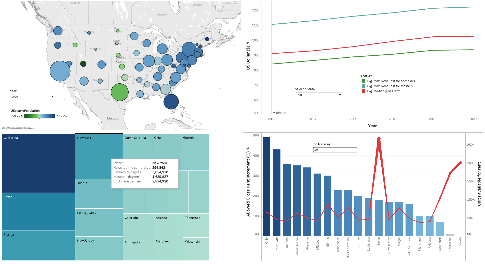

# RENTAL COSTS ON THE RISE

## Overview

### Business Problem

Many Americans today have chosen to rent housing vs. buying. Some of their choices are no maintenance costs to cover, no real estate taxes to pay, access to complimentary amenities, or even more flexibility if the renter decides to relocate. Rental properties were forced to lock in on current rental rates during the pandemic. However, now that Americans are returning to normalcy, rental rates have risen.

Typically, the highest rent increase was about 3% in the past. However, America is seeing at least an 11% increase from a year earlier, with some larger cities showing 30-40% increases. Unfortunately, the average renter's income is not increasing at these same rates, causing renters to become homeless. Even though many homeless people might be employed, they just cannot afford housing.

Our goal is to create a data-driven tool that will demonstrate whether there is a link between rising rent and homelessness in the United States.

### Business Impact

Homelessness has a massive impact on the health and well-being of families nationwide. Among numerous health issues, homeless people are exposed to more outside elements:  hot, cold, rain, snow, hurricanes, tornados, which increase the likelihood of getting sickness, injury, or disease can spread.

Additionally, [Bridges](https://journals.sagepub.com/doi/abs/10.1177/00111287221087957) (2022) has reported a strong correlation between homelessness and crime, which does not necessarily mean that homeless people cause offense. But due to harsh living conditions and a lack of defending themselves, they are vulnerable to hate crime.

Finally, [Ventriglio et al.](https://www.google.com/books/edition/Homelessness_and_Mental_Health/4_hQEAAAQBAJ?hl=en&gbpv=0) (2022) gave an outstanding review of the link between homelessness and mental health illnesses, which is obvious. Social and economic issues such as poverty, migration, unemployment, access to healthcare, and urbanization significantly impact both. As a result, understanding the cultural context is necessary for providing the best care in the community.

### Potential Audience

The public might be interested in having a tool that can show how changes in rent costs impact the level of homelessness in the USA.

Despite that, several government agencies should be another potential audience because they can develop creative strategies to mitigate the problem. Solutions can cover programs such as temporary housing, career training, financial management, and child care services.

----

## Scope

The goal of this project was to create a data-driven tool to visualize whether there is a link between rising rent cost and homelessness among people who possesses a bachelor's degree or above in the United States.

----

## Data Analysis and Manipulation

The data used in this project was obtained from two US-official sources between 2015 to 2020.

First, the estimated US population will be grabbed from the US Census website, filtered by the following topics:

1. Geography > Nation > United States
2. Population and People > Population and People

Besides the broad information that can be obtained, this project was focused on the following features:

- Name of the state
- Year
- Total population
- Population in households
- Educational attainment
- Employment status
- Income
- Housing tenure
- Gross rent cost

The selected variables from the Census.gov (see table below) were pulled out via API using a short python code which is available at [https://github.com/aliglara/capstone-c1-DA/blob/main/codes/grab_data_census.py](https://github.com/aliglara/capstone-c1-DA/blob/main/codes/grab_data_census.py)

*~200 rows & 53 columns.* Size 66.0 KB

| Variable Name | Description  | Type |
|---|---|---|
| B01001_001E | Population | int |
| B11001_001E | Population in households | int |
| B17001_002E | Pop. below poverty level | int |
| B17001_031E | Pop. at or Above poverty level | int |
| B23025_002E | Pop. in Labor Force | int |
| B23025_007E | Pop. not in Labor Force | int |
| B23006_024E | Bachelor or higher Pop. in labor force | int |
| B23006_029E | Bachelor or higher Pop. not labor force | int |
| B15003_001E | Total Population 25 years and over - Educ. attainment | int |
| B15003_002E | Population 25 years and over - No schooling completed | int |
| B15003_022E | Population 25 years and over - Bachelor's degree | int |
| B15003_023E | Population 25 years and over - Master's degree | int |
| B15003_023E | Population 25 years and over - Doctorate degree | int |
| B19013_001E | Median household Earnings($) | int |
| B20004_001E | Median Earnings - Educational attainment | int |
| B20004_005E | Median Earnings - Bachelor | int |
| B20004_006E | Median Earnings - Master or Above | int |
| B25001_001E | Total housing units | int |
| B25002_002E | Total Occupied housing units | int |
| B25003_003E | Total Renter occupied - Tenure | int |
| B25118_014E | Total Renter occupied - by income | int |
| B25013_001E | Total housing units - Educational attainment | int |
| B25013_007E | Total Renter-occupied units- Educational attainment | int |
| B25013_008E | Renter-occupied units - Less than high school graduate | int |
| B25013_009E | Renter-occupied units - High school graduate | int |
| B25013_010E | Renter-occupied units - Some college degree | int |
| B25013_011E | Renter-occupied units - Bachelor's degree or higher | int |
| B25064_001E | Median gross rent | int |

Second, The estimate of homelessness population by state was pulled out from the HUD Exchange website. The information was downloaded in an Excel file.

| File name | 2007-2021-PIT-Counts-by-State (2007 - 2020) |
|-|-|
| Name | PIT and HIC Data Since 2007 |
| Size | 1.1 MB |
| Source | [https://www.hudexchange.info](https://www.hudexchange.info) |
| Direct link | [https://www.hudexchange.info/resource/3031/pit-and-hic-data-since-2007](https://www.hudexchange.info/resource/3031/pit-and-hic-data-since-2007) |

**The dataset was stored on my Heroku server to brush up on SQL coding. However, the original csv files are available in the GitHub repository. Click on -> ([link](https://github.com/aliglara/capstone-c1-DA/tree/main/data))**

The EDA was split in the following sections:

1. General population and Homeless population data
2. Gross rent increase
3. Income and rent expenses by bachelor's professional or above

----

## EDA Results

### US population and homeless population information

**How the US population has changed from 2015 to 2020?**

Let's add 4 columns to the dataframe:

- Homeless population percentage
- Change of homeless population percentage yearly
- Normalized homeless population
- Normalized total population

$$
\begin{aligned}
 & \text{Homeless pop perc.} = \frac{\text{Homeless pop}}{\text{Population}} \cdot 100 \\
 & \text{Normalized population} = \frac{\text{population(i)} - \min(\text{population})}{\max(\text{population}) - \min(\text{population})}
\end{aligned}
$$

> Takeaways:
> 
> - Since 2017, the total US-homeless population has increased an average of 1% yearly
> - Based on the Census.gov database, the highest US homeless population was registered in 2020
> - The US population registered a 0.5% decrease between 2019 and 2020
> - The homeless population is 0.16% of the total population from 2015 to 2020

**How the homeless population is distributed in the US states?**

California is the state with the highest homeless population in the country. Besides, there were no massive changes in the states with homeless people during the last four years.

Let's find out what are the top 10 states for each year

The top ten states showed in the previous figures are not kept constant during the period study. Let's find out which states were on the top 10 list per year

Between 2015 and 2020, these are the 13 states that has been reported in the top 10 homeless population

| Name          | Name     |
|---------------|----------|
| California    | Georgia  |
| New York      | Oregon   |
| Florida       | Illinois |
| Texas         | Colorado |
| Massachusetts | Ohio     |
| Pennsylvania  |          |

**How the homeless population is distributed in the US regions?**

 It can be shown the US-region where there are more people experiencing homelessness is the **West** region.

In order to show the variation over time, let's create a lineplot.

Based on this figure, California (CA) is the state where homeless population has 
increased the most from 2018 to 2020. The New York state (NY) has shown a 
continuous  growing in the homeless population as well. 
In contrast, Florida (FL) has shown a continuous decrease since 2015.

Due to the magnitude order, homeless population for the rest of the states 
has been shrunk to the plot bottom. Because of that, let's split the graph

> On the previous graph, it can be observed that the homeless population has increased considerably in Texas and Washington. In contrast, Pennsylvania and  Illinois show that growth slowed down noticeably.
An interesting case is Georgia state, where homelessness has decreased dramatically. Finally, Colorado state shows a steady level, while Ohio appeared on the map in 2019 with a 3%-increase in the homeless population.

### 25-year and over US population

The main project goal is to analyze recent US population data to answer the question:

**Will a rent cost increment increase the risk of people who have been awarded an educational degree experiencing homelessness?**

Because of that, in the following section, a comparison between the US 25-year-and-over population is shown. A pivot table was creataed where the 25-year and over population is summed by year, and the results are showed in the following plots

From the left plot, the 25-year population who have earned a formal educational level increased by around 4% from 2015 to 2019. However, in 2020, an almost 1% decrease is shown.

On the right graph, the bachelor's graduate population has kept 30% higher than the master's and above graduates from 2015 to 2020.

Interestingly, the population who haven't finished schooling has risen steadily to 1% of the total 25-year population during the same timespan.

In general, bachelor's graduate population represent a 20% of the population based on educational attainment while the master's one a 15%.

### US states with higher homeless population variance from 2015 - 2020

In order to visualize the relative change between the homeless population and the total population. Let's create the following ratio

$$
\begin{align}
\text{ratio} = \frac{\text{Homeless population}}{\text{Total population}} \cdot 100
\end{align}
$$

From the graph, New York is the state with the highest proportion of people experiencing  homelessness. Along New York, the states with higher ratio homeless/population are: California, Oregon, Washington and Massachusetts.

On the other hand, Colorado, Florida, Arizona have a lower ratio, while Illinois has the lowest ratio in the group of states.

The group top ratio homeless-population states can be split at 0.25% level.

These plots are interesting because show which states have had higher variance (change) on the ratio homeless-population in the last 6 years.

Based on those results, a better selection of the states for further study can be done. Let's calculate the mean and std for each feature. The selection of states will be those whose std homeless is higher than 0.011.

California, Massachusetts, Oregon, Florida, Georgia, New York, Washington, Colorado are the states with higher variance on the homeless population.

### Distribution of renter housing units by educational attainment level

The data was taken from the census.gov and it refers to the number of housing units available for rent, and the amount of occupied by people based on their educational level.

Therefore, the total of units by state represents the total number of renter housing units occupied by people based on their instructional level.

### Percentage of the units occupied by Bachelors or above

The information taken from teh census.gov website was aggregated in a pivot Table. For there the percentage of occupied houses by Bachelors or above was caculated. The results are shown in the next figure.

From there, we can say:

- From 2015 to 2020, bachelor's or above has rented between 22% to 35% of the rental housing market in the selected states.
- Oregon had shown around 2%-increment in houses rented by bachelors or above between 2017 and 2020. In contrast, it was about a 1%-decrease between 2019 and 2020 is shown in Massachusetts and Colorado.
- For the rest of the states, the rental rate is slowing down.

### Bachelors and above graduate income

In this section, the features related to income and gross rent cost were analyzed focusing on professional householders. We were interested in comparing the average of the income for a bachelor and master graduates?

The average of the median income had been increased yearly from 2015 to 2019 for both professional groups. However, from 2019 to 2020 their income decreased by 5% approx.

Based on the obtained results, a Master's degree holder earns an average of 30% higher than a bachelor graduate. In California, a master graduate earns 40% over a bachelor professional, while in Georgia is only 25% more.

For estimate what is the maximum rent cost that a bachelor or master graduate could afford, let's assume a deduction of 37% in taxes and the gross monthly income has to be twice higher than the rent cost.

$$
\begin{align}
\text{max rent cost} = \text{salary}\cdot \left(\frac{100 - \text{tax perc}}{12 \cdot \text{ratio} \cdot 100}\right)
\end{align}
$$

This figure is fascinating. The average gross rent cost in the selected states had had a constant increase between 2015 to 2019. Nevertheless, in 2020 showed a slightly decrease.

 It is shown that the median income for a bachelor's graduate is not enough to rent a house in none of the selected US-States. Florida is the only state where a bachelor's graduate roughly can afford the median gross rental cost.

In contrast, a master's graduate should be able to afford the median gross rent in all the states except Colorado and Florida.

Another thing is the gross rent cost has been increasing steadily in all States. California shows a 25%-increment percentage around %25, which is the higher observed among the selected States. On the other hand, the gross rent cost showed a slight decrease between 2019 and 2020.

Assuming the rent cost and median earning for master graduated kept constant in 2020. What it would be the maximum rental cost increase that master's graduate can afford?

In the previous figure, bars represent the maximum percentage of gross rent cost that can be increased before master’s graduates or above can’t afford it from 2020. The red line represented the number of housing units for rent. For example, in Georgia, the gross rent can be raised to 16%, but there are only 75,000 units available. In contrast, there are around 200,000 units available in Florida, but master’s graduates can’t afford the rent cost now, let alone an increment on it

### Distribution of renter housing units by income salary

Assuming the rent cost increases higher than the maximum a master graduate can afford, are there cheaper rental options?

Based on our last result, let's focus on Georgia, Massachusetts, Washington, New York and California

The average income for a master's graduate is USD75,000 which belongs to range where there are more renter housing units available in the selected states. Below the income range USD 50,000 to USD 74,999 most of the available housing units are rented by people who earn between USD 25,000 to USD50,000.

Therefore, it seems more likely in case of the rent cost increase more than maximum allowed that group of people could find cheaper places.

Based on the figure, the distribution of rented housing is not the same for all states. However, most units are rented by household income between USD 50,000 and 74,999.
Interestingly, the distribution of rented units for household income of USD 35,000 or above in California and New York tends to be uniform. On the other hand, for income range of USD 25,000 or less, the distribution of housing units is almost uniform.

Finally, in California, New York, and Massachusetts, the proportion of rented housing units with an income of USD 150,000 or above is significantly higher than in the rest of the seleted US States.

Let's check is the number of houses rented by people who earn less money than a master's graduate has increased since 2019

### Visualization of distribution of renter housing units

A barplot is required a categorical variable on the x-axis, in our case, gross rent prices range. On the y-axis, a numerical value is needed which it will be the number of housing units.

The next figure shows a set of 6 barplots (one for each year) for each state.

Based on the picture, the most of the renter housing units are in the range of USD 750 to $2500. However, it is difficult to observe if the number of units has changed over time.

### Cumulative Distribution of renter housing units

Let's plot a cumulative distribution by state by year

There are several takeaways from there.

1. In the universe of the 10 top states where there has been a significant change in the homeless population, there are more housing units with rent costs between $750 to $2000.
2. California has the highest number of housing units for rent in the USA.
3. The distribution of housing units for rent is similar in California and New York.  In both states, the homeless population has increased over the last three years.
4. The total of units has decreased since 2015 in all states. However, in 2018-2020 (an increase in the homeless population), rental units have been almost the same in all states.
5. Interestingly, Florida's distribution of renter housing units is similar to California. Still, in Florida, the homeless population has decreased compared to California.

## Dashboard

In order to show the most important visualizations from the EDA, a dashboard was created on Tableau Public which is available at the next [link](https://public.tableau.com/app/profile/ali.lara/viz/RENTALCOSTSONTHERISE-Mightgraduatepeopleexperiencehomelessness/Story?publish=yes)

In summary the story on Tableau has two dashboards:

- The first one shows the data related to total population and homeless population.
- the second one shows the distribution of the 25 year+ population on the US territories, how the median income and median gross rent have changed from 2015 to 2020, and finally it shows in which states master graduate people can afford an increase on the average gross rent cost.

## Conclusions

- Overall, America’s homeless population has increased an average of 2.5% yearly since 2018. However, the population registered a 0.5%-decrease between 2019 and 2020.  From 2015-2020, the homeless population was 0.16% of the total population.
- The states with the highest rate of homelessness over the course of five years include California, New York, and Florida, respectfully.
- From 2015 to 2020, bachelor's graduate or above population has rented between 22% to 35% of the rental housing market.
- In average, Master's graduate earn an average of 30% more than undergraduate professional.
- A bachelor graduate can not afford the median gross rent nationwide. Therefore, a future increase on this expense won't lead them to experience homelessness.
- For master graduate and above population, an increase of gross rent between 1% and 16% can be allowed without affect their monthly budget in Georgia, Massachusetts, Washington, New York, Oregon and California.
- In Texas, there are the highest number of housing units available for rent in the USA.