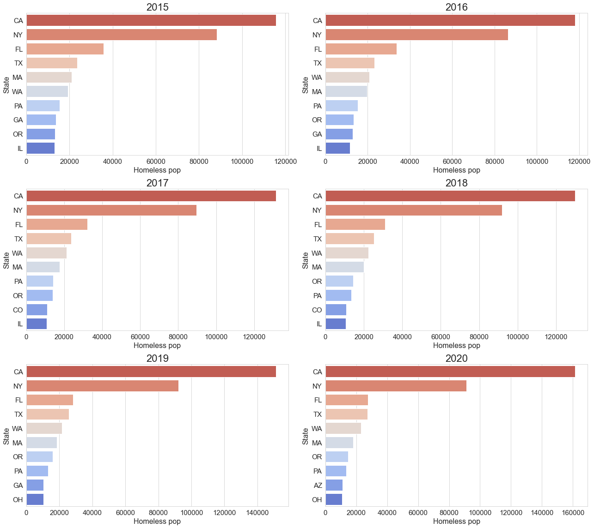
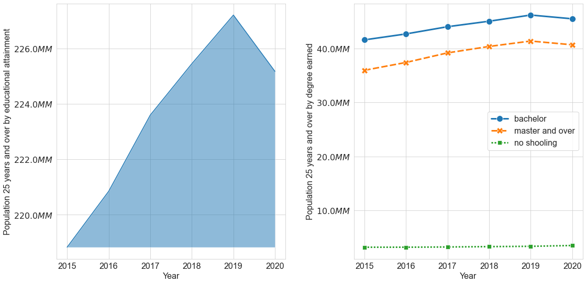

# Exploratory Data Analysis (EDA)

The EDA was split in the following sections:
1. General population and Homeless population data
1. Gross rent increase
1. Income and rent expenses by bachelor's professional or above

## Introduction 
### Scope

The goal of this project was to create a data-driven tool to visualize whether there is a link between rising rent cost and homelessness among people who possesses a bachelor's degree or above in the United States.

### Dataset

The data used in this project was obtained from two US-official sources between 2015 to 2020.

First, the estimated US population will be grabbed from the US Census website, filtered by the following topics:

1. Geography > Nation > United States
2. Population and People > Population and People

Besides the broad information that can be obtained, this project was focused on the following features:

- Name of the state
- Year
- Total population
- Population in households
- Educational attainment
- Employment status
- Income
- Housing tenure
- Gross rent cost

Second, The estimate of homelessness population by state was pulled out from the HUD Exchange website

**The dataset was stored on my Heroku server to brush up on SQL coding. However, the original csv files are available in the GitHub repository. Click on -> ([link](https://github.com/aliglara/capstone-c1-DA/tree/main/data))**


## US population and homeless populatio information

### Grabbing and combining datasets
Let's combine the information from the Census.gov and HUC dataset using a SQL


<div>
<style scoped>
    .dataframe tbody tr th:only-of-type {
        vertical-align: middle;
    }

    .dataframe tbody tr th {
        vertical-align: top;
    }

    .dataframe thead th {
        text-align: right;
    }
</style>
<table border="1" class="dataframe">
  <thead>
    <tr style="text-align: right;">
      <th></th>
      <th>year</th>
      <th>name_state</th>
      <th>abbreaviation</th>
      <th>population</th>
      <th>homeless_pop</th>
      <th>population_in_households</th>
      <th>pop_in_labor_force</th>
      <th>bachelor_or_higher_pop_in_labor_force</th>
      <th>total_population_25_years_and_over_educ_attainment</th>
      <th>population_25_years_and_over_no_schooling_completed</th>
      <th>population_25_years_and_over_bachelor_degree</th>
      <th>pop_25y_master_over</th>
      <th>region</th>
    </tr>
  </thead>
  <tbody>
    <tr>
      <th>0</th>
      <td>2015</td>
      <td>Mississippi</td>
      <td>MS</td>
      <td>2992333</td>
      <td>1983</td>
      <td>1104371</td>
      <td>1335130</td>
      <td>268930</td>
      <td>1952337</td>
      <td>28332</td>
      <td>253036</td>
      <td>223786</td>
      <td>South</td>
    </tr>
    <tr>
      <th>1</th>
      <td>2015</td>
      <td>Missouri</td>
      <td>MO</td>
      <td>6083672</td>
      <td>6482</td>
      <td>2374180</td>
      <td>3062893</td>
      <td>813903</td>
      <td>4097212</td>
      <td>35703</td>
      <td>706922</td>
      <td>640856</td>
      <td>South</td>
    </tr>
    <tr>
      <th>2</th>
      <td>2015</td>
      <td>Montana</td>
      <td>MT</td>
      <td>1032949</td>
      <td>1709</td>
      <td>414804</td>
      <td>516733</td>
      <td>141994</td>
      <td>706329</td>
      <td>3347</td>
      <td>144135</td>
      <td>100088</td>
      <td>West</td>
    </tr>
    <tr>
      <th>3</th>
      <td>2015</td>
      <td>Nebraska</td>
      <td>NE</td>
      <td>1896190</td>
      <td>2744</td>
      <td>744159</td>
      <td>1025079</td>
      <td>275822</td>
      <td>1232583</td>
      <td>12252</td>
      <td>244556</td>
      <td>180058</td>
      <td>Midwest</td>
    </tr>
    <tr>
      <th>4</th>
      <td>2015</td>
      <td>Nevada</td>
      <td>NV</td>
      <td>2890845</td>
      <td>8743</td>
      <td>1042065</td>
      <td>1455305</td>
      <td>297028</td>
      <td>1968167</td>
      <td>32904</td>
      <td>304948</td>
      <td>224390</td>
      <td>West</td>
    </tr>
  </tbody>
</table>
</div>


```python
# Verify if there are null values
```

    year                                                   0
    name_state                                             0
    abbreaviation                                          0
    population                                             0
    homeless_pop                                           0
    population_in_households                               0
    pop_in_labor_force                                     0
    bachelor_or_higher_pop_in_labor_force                  0
    total_population_25_years_and_over_educ_attainment     0
    population_25_years_and_over_no_schooling_completed    0
    population_25_years_and_over_bachelor_degree           0
    pop_25y_master_over                                    0
    region                                                 0
    dtype: int64


<div>
<style scoped>
    .dataframe tbody tr th:only-of-type {
        vertical-align: middle;
    }

    .dataframe tbody tr th {
        vertical-align: top;
    }

    .dataframe thead th {
        text-align: right;
    }
</style>
<table border="1" class="dataframe">
  <thead>
    <tr style="text-align: right;">
      <th></th>
      <th></th>
      <th>State abbr</th>
      <th>Population</th>
      <th>Homeless pop</th>
      <th>Pop in households</th>
      <th>Pop in labor force</th>
      <th>Bachelor+ in labor force</th>
      <th>Pop. 25year+ educ</th>
      <th>Pop. 25year+ no schooling</th>
      <th>Pop. 25year+ bachelor</th>
      <th>Pop. 25year+ master over</th>
      <th>Region</th>
    </tr>
    <tr>
      <th>Year</th>
      <th>State name</th>
      <th></th>
      <th></th>
      <th></th>
      <th></th>
      <th></th>
      <th></th>
      <th></th>
      <th></th>
      <th></th>
      <th></th>
      <th></th>
    </tr>
  </thead>
  <tbody>
    <tr>
      <th rowspan="5" valign="top">2015</th>
      <th>Mississippi</th>
      <td>MS</td>
      <td>2992333</td>
      <td>1983</td>
      <td>1104371</td>
      <td>1335130</td>
      <td>268930</td>
      <td>1952337</td>
      <td>28332</td>
      <td>253036</td>
      <td>223786</td>
      <td>South</td>
    </tr>
    <tr>
      <th>Missouri</th>
      <td>MO</td>
      <td>6083672</td>
      <td>6482</td>
      <td>2374180</td>
      <td>3062893</td>
      <td>813903</td>
      <td>4097212</td>
      <td>35703</td>
      <td>706922</td>
      <td>640856</td>
      <td>South</td>
    </tr>
    <tr>
      <th>Montana</th>
      <td>MT</td>
      <td>1032949</td>
      <td>1709</td>
      <td>414804</td>
      <td>516733</td>
      <td>141994</td>
      <td>706329</td>
      <td>3347</td>
      <td>144135</td>
      <td>100088</td>
      <td>West</td>
    </tr>
    <tr>
      <th>Nebraska</th>
      <td>NE</td>
      <td>1896190</td>
      <td>2744</td>
      <td>744159</td>
      <td>1025079</td>
      <td>275822</td>
      <td>1232583</td>
      <td>12252</td>
      <td>244556</td>
      <td>180058</td>
      <td>Midwest</td>
    </tr>
    <tr>
      <th>Nevada</th>
      <td>NV</td>
      <td>2890845</td>
      <td>8743</td>
      <td>1042065</td>
      <td>1455305</td>
      <td>297028</td>
      <td>1968167</td>
      <td>32904</td>
      <td>304948</td>
      <td>224390</td>
      <td>West</td>
    </tr>
  </tbody>
</table>
</div>


### How the US population has changed from 2015 to 2020


```python
# Perform some aggregation functions on the data
# Pivot table for total number per year
total_pt = pd.pivot_table(
    data= indexed_data_df,    # Range in Excel
    index="Year",             # Rows in Excel
    values=["Population", "Homeless pop"], # Values in Excel
    aggfunc=sum               # Aggregation function
)
```

Let's add 4 columns to the dataframe:
- Homeless population percentage
$$ \text{Homeless pop (\%)} = \frac{\text{Homeless pop}}{\text{Population}} \; 100 $$
- Change of homeless population percentage yearly
- Normalized homeless population 
$$ \text{Normalized homeless population} = \frac{\text{homeless population(i)}}{\max(\text{homeless population})} $$
- Normalized total population
$$ \text{Normalized population} = \frac{\text{population(i)}}{\max(\text{population})} $$


<div>
<style scoped>
    .dataframe tbody tr th:only-of-type {
        vertical-align: middle;
    }

    .dataframe tbody tr th {
        vertical-align: top;
    }

    .dataframe thead th {
        text-align: right;
    }
</style>
<table border="1" class="dataframe">
  <thead>
    <tr style="text-align: right;">
      <th></th>
      <th>Homeless pop</th>
      <th>Population</th>
      <th>Homeless pop (%)</th>
      <th>Homeless change (%)</th>
      <th>Homeless adim</th>
      <th>Pop adim</th>
    </tr>
    <tr>
      <th>Year</th>
      <th></th>
      <th></th>
      <th></th>
      <th></th>
      <th></th>
      <th></th>
    </tr>
  </thead>
  <tbody>
    <tr>
      <th>2015</th>
      <td>559194</td>
      <td>324893003</td>
      <td>0.172116</td>
      <td>NaN</td>
      <td>0.972757</td>
      <td>0.980267</td>
    </tr>
    <tr>
      <th>2016</th>
      <td>544951</td>
      <td>326538822</td>
      <td>0.166887</td>
      <td>-2.547059</td>
      <td>0.947980</td>
      <td>0.985233</td>
    </tr>
    <tr>
      <th>2017</th>
      <td>545690</td>
      <td>329056355</td>
      <td>0.165835</td>
      <td>0.135609</td>
      <td>0.949265</td>
      <td>0.992829</td>
    </tr>
    <tr>
      <th>2018</th>
      <td>547200</td>
      <td>330362592</td>
      <td>0.165636</td>
      <td>0.276714</td>
      <td>0.951892</td>
      <td>0.996770</td>
    </tr>
    <tr>
      <th>2019</th>
      <td>561563</td>
      <td>331433217</td>
      <td>0.169435</td>
      <td>2.624817</td>
      <td>0.976878</td>
      <td>1.000000</td>
    </tr>
    <tr>
      <th>2020</th>
      <td>574855</td>
      <td>329824950</td>
      <td>0.174291</td>
      <td>2.366965</td>
      <td>1.000000</td>
      <td>0.995148</td>
    </tr>
  </tbody>
</table>
</div>

  

    


Takeaways:
- Since 2018, the total US-homeless population has increased an average of 2.5% yearly
- Based on the Census.gov database, the highest US homeless population was registered in 2020
- The US population registered a 0.5%-decrease between 2019 and 2020
- The homeless population is 0.16% of the total population from 2015 to 2020

### How the homeless population is distributed on the US territories

    

    


Based on those figures, California is the state with a higher homeless population. Besides, there were no significant changes in the states with homeless people during the last four years.

Let's find out what are the top 10 states for each year
    

    


What are the states that has been reported on the top 10 list between 2015 to 2020?

The top ten states list isn't kept constant during the period study. 
Let's find out which states were on the top 10 list per year


    Between 2015 and 2020, these are the 13 states that has been reported in the top 10 homeless population list:

    0        California
    1          New York
    2           Florida
    3             Texas
    4     Massachusetts
    5        Washington
    6      Pennsylvania
    7           Georgia
    8            Oregon
    9          Illinois
    10         Colorado
    11             Ohio
    12          Arizona


What are the US regions where those states belong to?

<div>
<style scoped>
    .dataframe tbody tr th:only-of-type {
        vertical-align: middle;
    }

    .dataframe tbody tr th {
        vertical-align: top;
    }

    .dataframe thead th {
        text-align: right;
    }
</style>
<table border="1" class="dataframe">
  <thead>
    <tr style="text-align: right;">
      <th></th>
      <th>abbreviation</th>
      <th>name</th>
      <th>region</th>
    </tr>
  </thead>
  <tbody>
    <tr>
      <th>0</th>
      <td>AZ</td>
      <td>Arizona</td>
      <td>Southwest</td>
    </tr>
    <tr>
      <th>1</th>
      <td>CA</td>
      <td>California</td>
      <td>West</td>
    </tr>
    <tr>
      <th>2</th>
      <td>CO</td>
      <td>Colorado</td>
      <td>West</td>
    </tr>
    <tr>
      <th>3</th>
      <td>FL</td>
      <td>Florida</td>
      <td>South</td>
    </tr>
    <tr>
      <th>4</th>
      <td>GA</td>
      <td>Georgia</td>
      <td>South</td>
    </tr>
    <tr>
      <th>5</th>
      <td>IL</td>
      <td>Illinois</td>
      <td>Midwest</td>
    </tr>
    <tr>
      <th>6</th>
      <td>MA</td>
      <td>Massachusetts</td>
      <td>New England</td>
    </tr>
    <tr>
      <th>7</th>
      <td>NY</td>
      <td>New York</td>
      <td>Middle Atlantic</td>
    </tr>
    <tr>
      <th>8</th>
      <td>OH</td>
      <td>Ohio</td>
      <td>Midwest</td>
    </tr>
    <tr>
      <th>9</th>
      <td>OR</td>
      <td>Oregon</td>
      <td>West</td>
    </tr>
    <tr>
      <th>10</th>
      <td>PA</td>
      <td>Pennsylvania</td>
      <td>Middle Atlantic</td>
    </tr>
    <tr>
      <th>11</th>
      <td>TX</td>
      <td>Texas</td>
      <td>Southwest</td>
    </tr>
    <tr>
      <th>12</th>
      <td>WA</td>
      <td>Washington</td>
      <td>West</td>
    </tr>
  </tbody>
</table>
</div>


From the last figure, it can be shown the US-region where most high-homeless population states are located in the West region.

### How has changed the homeless population of those states over time?

In order to show the variation over time, let's create a lineplot.

     

Based on this figure, California (CA) is the state where the homelessness population has increased the most from 2018 to 2020. The New York state (NY) has shown a continuous homelessness increase.

In contrast, Florida (FL) has shown a continuous decrease since 2015. Let's see the behaviour of the rest of the states.

Due the magnitud order, the homeless population for the rest of the states has been shrunk to the plot bottom. Because of that, let's split the graph

 

On the previous graph, it is possible to observe that the homeless population has increased considerably in Texas and Washington states. In contrast, Pennsylvania and  Illinois show that growth slowed down noticeably.
An interesting case is Georgia state, where homelessness has decreased dramatically. Finally, Colorado state shows a steady level, while Ohio appeared on the map in 2019 with a 3%-increase in the homeless population.

## Analyzing the 25 years and over US population

The main project goal is to analyze recent US population data to answer the question: 

**Will a rent cost increment increase the risk of people who have been awarded a degree experiencing homelessness?**

Because of that, in the following section, a comparison between the US 25-year-and-over population is shown.

Let's create a pivot table where the 25 year and over population is summed by year

```python
year25_pt = pd.pivot_table(
    data=indexed_data_df,
    index="Year",
    values=["Pop. 25year+ educ", "Pop. 25year+ no schooling", "Pop. 25year+ bachelor", "Pop. 25year+ master over"],
    aggfunc='sum'
)
```

<div>
<style scoped>
    .dataframe tbody tr th:only-of-type {
        vertical-align: middle;
    }

    .dataframe tbody tr th {
        vertical-align: top;
    }

    .dataframe thead th {
        text-align: right;
    }
</style>
<table border="1" class="dataframe">
  <thead>
    <tr style="text-align: right;">
      <th></th>
      <th>Pop. 25year+ bachelor</th>
      <th>Pop. 25year+ educ</th>
      <th>Pop. 25year+ master over</th>
      <th>Pop. 25year+ no schooling</th>
    </tr>
    <tr>
      <th>Year</th>
      <th></th>
      <th></th>
      <th></th>
      <th></th>
    </tr>
  </thead>
  <tbody>
    <tr>
      <th>2015</th>
      <td>41576643</td>
      <td>218829689</td>
      <td>35944674</td>
      <td>3191717</td>
    </tr>
    <tr>
      <th>2016</th>
      <td>42675515</td>
      <td>220847677</td>
      <td>37397456</td>
      <td>3197250</td>
    </tr>
    <tr>
      <th>2017</th>
      <td>44013586</td>
      <td>223593758</td>
      <td>39171256</td>
      <td>3238045</td>
    </tr>
    <tr>
      <th>2018</th>
      <td>45029878</td>
      <td>225446877</td>
      <td>40358458</td>
      <td>3305133</td>
    </tr>
    <tr>
      <th>2019</th>
      <td>46174068</td>
      <td>227200303</td>
      <td>41359648</td>
      <td>3360924</td>
    </tr>
    <tr>
      <th>2020</th>
      <td>45478307</td>
      <td>225168128</td>
      <td>40665846</td>
      <td>3513496</td>
    </tr>
  </tbody>
</table>
</div>

 

From the left plot, the 25-year population who have earned a formal educational level increased by around 4% from 2015 to 2019. However, in 2020, an almost 1% decrease is shown. 

On the left graph, the bachelor's graduate population has kept 30% higher than the master's and above graduates from 2015 to 2020.

Interestingly, the population who haven't finished schooling has risen steadily to 1% of the total 25-year population during the same timespan.

In general, bachelor's graduate population represent a 20% of the population based on educational attainment while the master's one a 15%.

## US Population in labor force and in households

```python
some_population_pt = pd.pivot_table(
    data=indexed_data_df.loc[2017:],
    index="Year",
    values=["Population", "Pop in households", "Pop in labor force", "Bachelor+ in labor force"],
    aggfunc='sum'
)
```

<div>
<style scoped>
    .dataframe tbody tr th:only-of-type {
        vertical-align: middle;
    }

    .dataframe tbody tr th {
        vertical-align: top;
    }

    .dataframe thead th {
        text-align: right;
    }
</style>
<table border="1" class="dataframe">
  <thead>
    <tr style="text-align: right;">
      <th></th>
      <th>Bachelor+ in labor force</th>
      <th>Pop in households</th>
      <th>Pop in labor force</th>
      <th>Population</th>
    </tr>
    <tr>
      <th>Year</th>
      <th></th>
      <th></th>
      <th></th>
      <th></th>
    </tr>
  </thead>
  <tbody>
    <tr>
      <th>2017</th>
      <td>49486843</td>
      <td>121254123</td>
      <td>165928662</td>
      <td>329056355</td>
    </tr>
    <tr>
      <th>2018</th>
      <td>50702924</td>
      <td>122699817</td>
      <td>167091685</td>
      <td>330362592</td>
    </tr>
    <tr>
      <th>2019</th>
      <td>51941004</td>
      <td>123973834</td>
      <td>168719014</td>
      <td>331433217</td>
    </tr>
    <tr>
      <th>2020</th>
      <td>51234055</td>
      <td>123559968</td>
      <td>167113763</td>
      <td>329824950</td>
    </tr>
  </tbody>
</table>
</div>


 
    


From this plot, the distribution of population in households, in labor and bachelor's graduate have kept almost the same since 2017. 

**Note**: 

    The Pop. in houselds and Pop. in labor percentages were calculated over the US-state population. However, the Bachelor+ in labor was calculated over the Pop. in labor for the US-state population

## Selection of the US states for further analysis

In order to visualize the relative change between the homeless population and the total population. Let's create the following ratio

$$ \text{ratio} = \frac{\text{Homeless population}}{\text{Total population}}\cdot 100 $$


<div>
<style scoped>
    .dataframe tbody tr th:only-of-type {
        vertical-align: middle;
    }

    .dataframe tbody tr th {
        vertical-align: top;
    }

    .dataframe thead th {
        text-align: right;
    }
</style>
<table border="1" class="dataframe">
  <thead>
    <tr style="text-align: right;">
      <th></th>
      <th>Year</th>
      <th>State name</th>
      <th>Population</th>
      <th>Homeless pop</th>
      <th>% homeless</th>
    </tr>
  </thead>
  <tbody>
    <tr>
      <th>8</th>
      <td>2015</td>
      <td>New York</td>
      <td>19795791</td>
      <td>88250</td>
      <td>0.445802</td>
    </tr>
    <tr>
      <th>11</th>
      <td>2015</td>
      <td>Ohio</td>
      <td>11613423</td>
      <td>11182</td>
      <td>0.096285</td>
    </tr>
    <tr>
      <th>13</th>
      <td>2015</td>
      <td>Oregon</td>
      <td>4028977</td>
      <td>13226</td>
      <td>0.328272</td>
    </tr>
    <tr>
      <th>14</th>
      <td>2015</td>
      <td>Pennsylvania</td>
      <td>12802503</td>
      <td>15421</td>
      <td>0.120453</td>
    </tr>
    <tr>
      <th>19</th>
      <td>2015</td>
      <td>Texas</td>
      <td>27469114</td>
      <td>23678</td>
      <td>0.086199</td>
    </tr>
    <tr>
      <th>...</th>
      <td>...</td>
      <td>...</td>
      <td>...</td>
      <td>...</td>
      <td>...</td>
    </tr>
    <tr>
      <th>283</th>
      <td>2020</td>
      <td>Massachusetts</td>
      <td>6873003</td>
      <td>17975</td>
      <td>0.261531</td>
    </tr>
    <tr>
      <th>284</th>
      <td>2020</td>
      <td>Texas</td>
      <td>28635442</td>
      <td>27229</td>
      <td>0.095088</td>
    </tr>
    <tr>
      <th>287</th>
      <td>2020</td>
      <td>Ohio</td>
      <td>11675275</td>
      <td>10655</td>
      <td>0.091261</td>
    </tr>
    <tr>
      <th>288</th>
      <td>2020</td>
      <td>Colorado</td>
      <td>5684926</td>
      <td>9846</td>
      <td>0.173195</td>
    </tr>
    <tr>
      <th>295</th>
      <td>2020</td>
      <td>Washington</td>
      <td>7512465</td>
      <td>22923</td>
      <td>0.305133</td>
    </tr>
  </tbody>
</table>
<p>78 rows × 5 columns</p>
</div>


 


From the graph, **New York** is the state with the highest proportion of people experiencing  homelessness. Along New York, the states with higher ratio homeless/population are: *California, Oregon, Washington and Massachusetts*.

On the other hand, *Colorado, Florida, Arizona* have a lower ratio, while **Illinois** has the lowest ratio in the group of states.

The group top ratio homeless-population states can be split at 0.25% level.


   

These plots are interesting because show which states have had higher variance (change) on the ratio homeless-population in the last 6 years.

Based on those results, a better selection of the states for further study can be done. Let's calculate the mean and std for each feature


```python
# Example of pivot table
subdata.groupby(["State name"])["% homeless"].agg(['mean', 'std']).sort_values(
    by="std", 
    ascending=False)
```


<div>
<style scoped>
    .dataframe tbody tr th:only-of-type {
        vertical-align: middle;
    }

    .dataframe tbody tr th {
        vertical-align: top;
    }

    .dataframe thead th {
        text-align: right;
    }
</style>
<table border="1" class="dataframe">
  <thead>
    <tr style="text-align: right;">
      <th></th>
      <th>mean</th>
      <th>std</th>
    </tr>
    <tr>
      <th>State name</th>
      <th></th>
      <th></th>
    </tr>
  </thead>
  <tbody>
    <tr>
      <th>California</th>
      <td>0.341894</td>
      <td>0.045757</td>
    </tr>
    <tr>
      <th>Massachusetts</th>
      <td>0.279207</td>
      <td>0.020963</td>
    </tr>
    <tr>
      <th>Oregon</th>
      <td>0.343536</td>
      <td>0.019093</td>
    </tr>
    <tr>
      <th>Florida</th>
      <td>0.150073</td>
      <td>0.018300</td>
    </tr>
    <tr>
      <th>Georgia</th>
      <td>0.107287</td>
      <td>0.018175</td>
    </tr>
    <tr>
      <th>New York</th>
      <td>0.457563</td>
      <td>0.014874</td>
    </tr>
    <tr>
      <th>Washington</th>
      <td>0.287690</td>
      <td>0.011720</td>
    </tr>
    <tr>
      <th>Colorado</th>
      <td>0.183129</td>
      <td>0.011054</td>
    </tr>
    <tr>
      <th>Arizona</th>
      <td>0.140096</td>
      <td>0.008513</td>
    </tr>
    <tr>
      <th>Illinois</th>
      <td>0.087233</td>
      <td>0.008216</td>
    </tr>
    <tr>
      <th>Pennsylvania</th>
      <td>0.110664</td>
      <td>0.007799</td>
    </tr>
    <tr>
      <th>Texas</th>
      <td>0.087466</td>
      <td>0.004502</td>
    </tr>
    <tr>
      <th>Ohio</th>
      <td>0.089982</td>
      <td>0.003480</td>
    </tr>
  </tbody>
</table>
</div>


The selection of states will be those whose std % homeless is higher than 0.011


    ['California',
     'Massachusetts',
     'Oregon',
     'Florida',
     'Georgia',
     'New York',
     'Washington',
     'Colorado']


## Number of renter housing units by educational attainment level

The data was taken from the census.gov and it refers to the number of housing units available for rent, and the amount of occupied by people based on their educational level.

Therefore, the total of units by state represents the total number of renter housing units occupied by people based on their instructional level.


### Percentage of the units occupied by Bachelors or above. 

$$ \text{Perc bachelor or higher} = \frac{\text{Bachelor degree or higher}}{\text{Total occupied units}}\cdot 100 $$


<div>
<style scoped>
    .dataframe tbody tr th:only-of-type {
        vertical-align: middle;
    }

    .dataframe tbody tr th {
        vertical-align: top;
    }

    .dataframe thead th {
        text-align: right;
    }
</style>
<table border="1" class="dataframe" style="width:100px">
  <thead>
    <tr style="text-align: right;">
      <th></th>
      <th></th>
      <th>Total occupied units</th>
      <th>HS graduate</th>
      <th>College degree</th>
      <th>Bachelor degree or higher</th>
      <th>Perc bachelor or higher</th>
    </tr>
    <tr>
      <th>Year</th>
      <th>State name</th>
      <th></th>
      <th></th>
      <th></th>
      <th></th>
      <th></th>
    </tr>
  </thead>
  <tbody>
    <tr>
      <th rowspan="8" valign="top">2015</th>
      <th>New York</th>
      <td>3394792</td>
      <td>844820</td>
      <td>845166</td>
      <td>1100677</td>
      <td>32.422517</td>
    </tr>
    <tr>
      <th>Oregon</th>
      <td>604314</td>
      <td>134547</td>
      <td>240163</td>
      <td>161900</td>
      <td>26.790708</td>
    </tr>
    <tr>
      <th>Washington</th>
      <td>1025304</td>
      <td>230928</td>
      <td>383616</td>
      <td>302918</td>
      <td>29.544213</td>
    </tr>
    <tr>
      <th>California</th>
      <td>5985534</td>
      <td>1200022</td>
      <td>1893017</td>
      <td>1744084</td>
      <td>29.138319</td>
    </tr>
    <tr>
      <th>Colorado</th>
      <td>752117</td>
      <td>159916</td>
      <td>272185</td>
      <td>237783</td>
      <td>31.615161</td>
    </tr>
    <tr>
      <th>Florida</th>
      <td>2703113</td>
      <td>746895</td>
      <td>905205</td>
      <td>676010</td>
      <td>25.008573</td>
    </tr>
    <tr>
      <th>Georgia</th>
      <td>1395241</td>
      <td>381047</td>
      <td>462321</td>
      <td>326843</td>
      <td>23.425559</td>
    </tr>
    <tr>
      <th>Massachusetts</th>
      <td>979998</td>
      <td>256051</td>
      <td>256315</td>
      <td>324354</td>
      <td>33.097414</td>
    </tr>
    <tr>
      <th>...</th>
      <td>...</td>
      <td>...</td>
      <td>...</td>
      <td>...</td>
      <td>...</td>
      <td>...</td>
    </tr>
    <tr>
      <th rowspan="8" valign="top">2020</th>
      <th>California</th>
      <td>5861796</td>
      <td>1139471</td>
      <td>1819433</td>
      <td>1894008</td>
      <td>32.311053</td>
    </tr>
    <tr>
      <th>New York</th>
      <td>3402708</td>
      <td>836585</td>
      <td>835974</td>
      <td>1177129</td>
      <td>34.593888</td>
    </tr>
    <tr>
      <th>Florida</th>
      <td>2680435</td>
      <td>734536</td>
      <td>875359</td>
      <td>726725</td>
      <td>27.112204</td>
    </tr>
    <tr>
      <th>Georgia</th>
      <td>1377105</td>
      <td>370881</td>
      <td>451423</td>
      <td>363727</td>
      <td>26.412438</td>
    </tr>
    <tr>
      <th>Oregon</th>
      <td>611573</td>
      <td>135147</td>
      <td>232841</td>
      <td>180989</td>
      <td>29.594014</td>
    </tr>
    <tr>
      <th>Massachusetts</th>
      <td>992088</td>
      <td>247804</td>
      <td>249190</td>
      <td>363796</td>
      <td>36.669731</td>
    </tr>
    <tr>
      <th>Colorado</th>
      <td>722078</td>
      <td>155657</td>
      <td>251821</td>
      <td>246568</td>
      <td>34.147004</td>
    </tr>
    <tr>
      <th>Washington</th>
      <td>1067763</td>
      <td>229626</td>
      <td>391055</td>
      <td>342751</td>
      <td>32.099914</td>
    </tr>
  </tbody>
</table>
</div>


Pivot Table for aggregating the percentage of occupied houses by Bachelors or above

```python
renter_occupied_df.pivot_table(
  index="State name",
  columns="Year", 
  values="Perc bachelor or higher")
```

<div>
<style scoped>
    .dataframe tbody tr th:only-of-type {
        vertical-align: middle;
    }

    .dataframe tbody tr th {
        vertical-align: top;
    }

    .dataframe thead th {
        text-align: right;
    }
</style>
<table border="1" class="dataframe" width="100px">
  <thead>
    <tr style="text-align: right;">
      <th>State name</th>
      <th>California</th>
      <th>Colorado</th>
      <th>Florida</th>
      <th>Georgia</th>
      <th>Massachusetts</th>
      <th>New York</th>
      <th>Oregon</th>
      <th>Washington</th>
    </tr>
    <tr>
      <th>Year</th>
      <th></th>
      <th></th>
      <th></th>
      <th></th>
      <th></th>
      <th></th>
      <th></th>
      <th></th>
    </tr>
  </thead>
  <tbody>
    <tr>
      <th>2015</th>
      <td>29.14</td>
      <td>31.62</td>
      <td>25.01</td>
      <td>23.43</td>
      <td>33.10</td>
      <td>32.42</td>
      <td>26.79</td>
      <td>29.54</td>
    </tr>
    <tr>
      <th>2016</th>
      <td>29.95</td>
      <td>31.16</td>
      <td>25.11</td>
      <td>25.34</td>
      <td>33.59</td>
      <td>32.53</td>
      <td>27.62</td>
      <td>30.21</td>
    </tr>
    <tr>
      <th>2017</th>
      <td>30.93</td>
      <td>32.82</td>
      <td>25.01</td>
      <td>24.60</td>
      <td>34.08</td>
      <td>32.75</td>
      <td>27.56</td>
      <td>30.44</td>
    </tr>
    <tr>
      <th>2018</th>
      <td>31.28</td>
      <td>33.89</td>
      <td>27.12</td>
      <td>25.55</td>
      <td>36.35</td>
      <td>33.50</td>
      <td>28.67</td>
      <td>31.98</td>
    </tr>
    <tr>
      <th>2019</th>
      <td>32.64</td>
      <td>35.35</td>
      <td>27.21</td>
      <td>26.87</td>
      <td>37.79</td>
      <td>34.94</td>
      <td>29.36</td>
      <td>32.41</td>
    </tr>
    <tr>
      <th>2020</th>
      <td>32.31</td>
      <td>34.15</td>
      <td>27.11</td>
      <td>26.41</td>
      <td>36.67</td>
      <td>34.59</td>
      <td>29.59</td>
      <td>32.10</td>
    </tr>
  </tbody>
</table>
</div>

     

    From there, we can say:
    - From 2015 to 2020, bachelor's or above has rented between 22% to 35% of the rental housing market in the selected states.
    - Oregon had shown around 2%-increment in houses rented by bachelors or above between 2017 and 2020. In contrast, it was about a 1%-decrease between 2019 and 2020 is shown in Massachusetts and Colorado.
    - For the rest of the states, the rental rate is slowing down.

## Median income of bachelors or above 
In this section, the features related to income and gross rent cost are analyzed focusing on professional householders. 


```python
# Here are the name of the selected columns
query = ("SELECT year, name_state, "
         " median_earnings_bachelor, "
         " median_earnings_master_or_above, "
         " median_gross_rent "
         " FROM us_population "
         " WHERE name_state IN ('" + "', '".join(list_states) + "')")
```


What is the average national of the income for a bachelor and master graduates?

The next pivot table will help to answer that question


```python
average_income_pt = pd.pivot_table(
    data=earning_df,
    values=["Bachelor earning", "Master or above earning"],
    index="Year")
```

<div>
<style scoped>
    .dataframe tbody tr th:only-of-type {
        vertical-align: middle;
    }

    .dataframe tbody tr th {
        vertical-align: top;
    }

    .dataframe thead th {
        text-align: right;
    }
</style>
<table border="1" class="dataframe">
  <thead>
    <tr style="text-align: right;">
      <th></th>
      <th>Bachelor earning</th>
      <th>Master or above earning</th>
    </tr>
    <tr>
      <th>Year</th>
      <th></th>
      <th></th>
    </tr>
  </thead>
  <tbody>
    <tr>
      <th>2015</th>
      <td>51547.125</td>
      <td>67579.250</td>
    </tr>
    <tr>
      <th>2016</th>
      <td>53728.125</td>
      <td>69625.250</td>
    </tr>
    <tr>
      <th>2017</th>
      <td>55125.375</td>
      <td>71916.625</td>
    </tr>
    <tr>
      <th>2018</th>
      <td>56791.125</td>
      <td>74543.375</td>
    </tr>
    <tr>
      <th>2019</th>
      <td>58474.500</td>
      <td>77522.625</td>
    </tr>
    <tr>
      <th>2020</th>
      <td>58469.625</td>
      <td>76875.375</td>
    </tr>
  </tbody>
</table>
</div>


From the previous results, the average of the median income had been increased yearly from 2015 to 2019 for both professional groups. However, from 2019 to 2020 their income decreased by 5% approx.

 

What it would be maximum rent cost a graduate professional could afford?

For this estimation, let's assume a professional will have to pay 37% in taxes and a mandatory requirement is that his/her monthly income has to twice higher than the rent cost offered.

$$ \text{max rent cost} = \text{salary}\, \left(\frac{100 - \text{\% taxes}}{12 \cdot \text{ratio} \cdot 100}\right) $$


<div>
<style scoped>
    .dataframe tbody tr th:only-of-type {
        vertical-align: middle;
    }

    .dataframe tbody tr th {
        vertical-align: top;
    }

    .dataframe thead th {
        text-align: right;
    }
</style>
<table border="1" class="dataframe" style="width:100px">
  <thead>
    <tr style="text-align: right;">
      <th></th>
      <th>Year</th>
      <th>State name</th>
      <th>Bachelor earning</th>
      <th>Master or above earning</th>
      <th>Gross rent</th>
      <th>Perc diff</th>
      <th>Max rent Bachelor</th>
      <th>Max rent Master</th>
    </tr>
  </thead>
  <tbody>
    <tr>
      <th>0</th>
      <td>2015</td>
      <td>New York</td>
      <td>55360</td>
      <td>71684</td>
      <td>1173</td>
      <td>29.49</td>
      <td>968.80</td>
      <td>1254.47</td>
    </tr>
    <tr>
      <th>1</th>
      <td>2015</td>
      <td>Oregon</td>
      <td>44049</td>
      <td>61139</td>
      <td>943</td>
      <td>38.80</td>
      <td>770.86</td>
      <td>1069.93</td>
    </tr>
    <tr>
      <th>2</th>
      <td>2015</td>
      <td>Washington</td>
      <td>55795</td>
      <td>71123</td>
      <td>1080</td>
      <td>27.47</td>
      <td>976.41</td>
      <td>1244.65</td>
    </tr>
    <tr>
      <th>3</th>
      <td>2015</td>
      <td>California</td>
      <td>57282</td>
      <td>80442</td>
      <td>1311</td>
      <td>40.43</td>
      <td>1002.44</td>
      <td>1407.74</td>
    </tr>
    <tr>
      <th>4</th>
      <td>2015</td>
      <td>Colorado</td>
      <td>50196</td>
      <td>63270</td>
      <td>1111</td>
      <td>26.05</td>
      <td>878.43</td>
      <td>1107.22</td>
    </tr>
    <tr>
      <th>5</th>
      <td>2015</td>
      <td>Florida</td>
      <td>42714</td>
      <td>57128</td>
      <td>1046</td>
      <td>33.75</td>
      <td>747.50</td>
      <td>999.74</td>
    </tr>
    <tr>
      <th>6</th>
      <td>2015</td>
      <td>Georgia</td>
      <td>49696</td>
      <td>61443</td>
      <td>909</td>
      <td>23.64</td>
      <td>869.68</td>
      <td>1075.25</td>
    </tr>
    <tr>
      <th>7</th>
      <td>2015</td>
      <td>Massachusetts</td>
      <td>57285</td>
      <td>74405</td>
      <td>1164</td>
      <td>29.89</td>
      <td>1002.49</td>
      <td>1302.09</td>
    </tr>
    <tr>
      <th>8</th>
      <td>2016</td>
      <td>New York</td>
      <td>56868</td>
      <td>73504</td>
      <td>1194</td>
      <td>29.25</td>
      <td>995.19</td>
      <td>1286.32</td>
    </tr>
    <tr>
      <th>9</th>
      <td>2016</td>
      <td>Oregon</td>
      <td>46942</td>
      <td>63868</td>
      <td>1015</td>
      <td>36.06</td>
      <td>821.48</td>
      <td>1117.69</td>
    </tr>
  </tbody>
</table>
</div>


**How much a master professional earns over a bachelor one?**


```python
pd.pivot_table(data=earning_df,
               index="State name",
               columns="Year",
               values="Perc diff",
               margins=True).round(2)
```


<div>
<style scoped>
    .dataframe tbody tr th:only-of-type {
        vertical-align: middle;
    }

    .dataframe tbody tr th {
        vertical-align: top;
    }

    .dataframe thead th {
        text-align: right;
    }
</style>
<table border="1" class="dataframe">
  <thead>
    <tr style="text-align: right;">
      <th>Year</th>
      <th>2015</th>
      <th>2016</th>
      <th>2017</th>
      <th>2018</th>
      <th>2019</th>
      <th>2020</th>
      <th>All</th>
    </tr>
    <tr>
      <th>State name</th>
      <th></th>
      <th></th>
      <th></th>
      <th></th>
      <th></th>
      <th></th>
      <th></th>
    </tr>
  </thead>
  <tbody>
    <tr>
      <th>California</th>
      <td>40.43</td>
      <td>36.84</td>
      <td>40.39</td>
      <td>44.68</td>
      <td>41.88</td>
      <td>41.93</td>
      <td>41.02</td>
    </tr>
    <tr>
      <th>Colorado</th>
      <td>26.05</td>
      <td>28.40</td>
      <td>29.73</td>
      <td>24.11</td>
      <td>22.99</td>
      <td>28.08</td>
      <td>26.56</td>
    </tr>
    <tr>
      <th>Florida</th>
      <td>33.75</td>
      <td>32.30</td>
      <td>33.53</td>
      <td>33.13</td>
      <td>30.57</td>
      <td>31.32</td>
      <td>32.43</td>
    </tr>
    <tr>
      <th>Georgia</th>
      <td>23.64</td>
      <td>23.27</td>
      <td>26.13</td>
      <td>23.19</td>
      <td>30.50</td>
      <td>27.31</td>
      <td>25.67</td>
    </tr>
    <tr>
      <th>Massachusetts</th>
      <td>29.89</td>
      <td>27.22</td>
      <td>28.67</td>
      <td>31.08</td>
      <td>31.12</td>
      <td>29.47</td>
      <td>29.58</td>
    </tr>
    <tr>
      <th>New York</th>
      <td>29.49</td>
      <td>29.25</td>
      <td>24.96</td>
      <td>27.03</td>
      <td>29.25</td>
      <td>28.61</td>
      <td>28.10</td>
    </tr>
    <tr>
      <th>Oregon</th>
      <td>38.80</td>
      <td>36.06</td>
      <td>32.56</td>
      <td>34.20</td>
      <td>34.97</td>
      <td>33.29</td>
      <td>34.98</td>
    </tr>
    <tr>
      <th>Washington</th>
      <td>27.47</td>
      <td>24.15</td>
      <td>28.07</td>
      <td>31.71</td>
      <td>37.98</td>
      <td>30.95</td>
      <td>30.05</td>
    </tr>
    <tr>
      <th>All</th>
      <td>31.19</td>
      <td>29.69</td>
      <td>30.51</td>
      <td>31.14</td>
      <td>32.41</td>
      <td>31.37</td>
      <td>31.05</td>
    </tr>
  </tbody>
</table>
</div>


A Master's degree holder earns an average of 30% more than a bachelor graduate in the last 6 years. In California, a master graduate earns 40% over a bachelor professional, while in Georgia is only 25% more.

**How much the gross rent has change over time?**


```python
pd.pivot_table(data=earning_df,
               index="State name",
               columns="Year",
               values="Gross rent",
               margins=True).round(2)
```


<div>
<style scoped>
    .dataframe tbody tr th:only-of-type {
        vertical-align: middle;
    }

    .dataframe tbody tr th {
        vertical-align: top;
    }

    .dataframe thead th {
        text-align: right;
    }
</style>
<table border="1" class="dataframe" width="100px">
  <thead>
    <tr style="text-align: right;">
      <th>Year</th>
      <th>2015</th>
      <th>2016</th>
      <th>2017</th>
      <th>2018</th>
      <th>2019</th>
      <th>2020</th>
      <th>All</th>
    </tr>
    <tr>
      <th>State name</th>
      <th></th>
      <th></th>
      <th></th>
      <th></th>
      <th></th>
      <th></th>
      <th></th>
    </tr>
  </thead>
  <tbody>
    <tr>
      <th>California</th>
      <td>1311.00</td>
      <td>1375</td>
      <td>1447.00</td>
      <td>1520.00</td>
      <td>1614.00</td>
      <td>1586.00</td>
      <td>1475.50</td>
    </tr>
    <tr>
      <th>Colorado</th>
      <td>1111.00</td>
      <td>1171</td>
      <td>1240.00</td>
      <td>1289.00</td>
      <td>1369.00</td>
      <td>1335.00</td>
      <td>1252.50</td>
    </tr>
    <tr>
      <th>Florida</th>
      <td>1046.00</td>
      <td>1086</td>
      <td>1128.00</td>
      <td>1182.00</td>
      <td>1238.00</td>
      <td>1218.00</td>
      <td>1149.67</td>
    </tr>
    <tr>
      <th>Georgia</th>
      <td>909.00</td>
      <td>933</td>
      <td>958.00</td>
      <td>1008.00</td>
      <td>1049.00</td>
      <td>1042.00</td>
      <td>983.17</td>
    </tr>
    <tr>
      <th>Massachusetts</th>
      <td>1164.00</td>
      <td>1179</td>
      <td>1208.00</td>
      <td>1295.00</td>
      <td>1360.00</td>
      <td>1336.00</td>
      <td>1257.00</td>
    </tr>
    <tr>
      <th>New York</th>
      <td>1173.00</td>
      <td>1194</td>
      <td>1226.00</td>
      <td>1274.00</td>
      <td>1309.00</td>
      <td>1315.00</td>
      <td>1248.50</td>
    </tr>
    <tr>
      <th>Oregon</th>
      <td>943.00</td>
      <td>1015</td>
      <td>1079.00</td>
      <td>1130.00</td>
      <td>1185.00</td>
      <td>1173.00</td>
      <td>1087.50</td>
    </tr>
    <tr>
      <th>Washington</th>
      <td>1080.00</td>
      <td>1135</td>
      <td>1216.00</td>
      <td>1316.00</td>
      <td>1359.00</td>
      <td>1337.00</td>
      <td>1240.50</td>
    </tr>
    <tr>
      <th>All</th>
      <td>1092.12</td>
      <td>1136</td>
      <td>1187.75</td>
      <td>1251.75</td>
      <td>1310.38</td>
      <td>1292.75</td>
      <td>1211.79</td>
    </tr>
  </tbody>
</table>
</div>


The average gross rent cost in the selected states had had a constant increase between 2015 to 2019. Nevertheless, in 2020 showed a slightly decrease.
    

    


This figure is fascinating. It is shown that the median income for a bachelor's graduate is not enough to rent a house in none of the selected US-States. Florida is the only state where a bachelor's graduate roughly can afford the median gross rental cost. 

In contrast, a master's graduate should be able to afford the median gross rent in all the states except Colorado and Florida. 

Another thing is the gross rent cost has been increasing steadily in all States. California shows a 25%-increment percentage around %25, which is the higher observed among the selected States. On the other hand, the gross rent cost showed a slight decrease between 2019 and 2020

**Note**:

    The blue dotted line represents the max rent cost a master graduate might afford based on the previous calculation. The gray line represents the same but for a bachelor graduate. 

    The orange line is the median gross rent cost, and the light blue area represents the gap between master's and bachelor's rent affordability.


Assuming the rent cost and median earnings data for master or above graduated is valid. What it would be the maximum rental cost increase that can be afford for that population sector in 2020?


<div>
<style scoped>
    .dataframe tbody tr th:only-of-type {
        vertical-align: middle;
    }

    .dataframe tbody tr th {
        vertical-align: top;
    }

    .dataframe thead th {
        text-align: right;
    }
</style>
<table border="1" class="dataframe" style="width:100px">
  <thead>
    <tr style="text-align: right;">
      <th></th>
      <th>State name</th>
      <th>Master or above earning</th>
      <th>Gross rent</th>
      <th>Max rent Master</th>
      <th>Max increase Master (%)</th>
    </tr>
  </thead>
  <tbody>
    <tr>
      <th>3</th>
      <td>Georgia</td>
      <td>69501</td>
      <td>1042</td>
      <td>1216.27</td>
      <td>16.72</td>
    </tr>
    <tr>
      <th>5</th>
      <td>Massachusetts</td>
      <td>84800</td>
      <td>1336</td>
      <td>1484.00</td>
      <td>11.08</td>
    </tr>
    <tr>
      <th>7</th>
      <td>Washington</td>
      <td>83120</td>
      <td>1337</td>
      <td>1454.60</td>
      <td>8.80</td>
    </tr>
    <tr>
      <th>1</th>
      <td>New York</td>
      <td>80506</td>
      <td>1315</td>
      <td>1408.86</td>
      <td>7.14</td>
    </tr>
    <tr>
      <th>4</th>
      <td>Oregon</td>
      <td>70453</td>
      <td>1173</td>
      <td>1232.93</td>
      <td>5.11</td>
    </tr>
    <tr>
      <th>0</th>
      <td>California</td>
      <td>91622</td>
      <td>1586</td>
      <td>1603.38</td>
      <td>1.10</td>
    </tr>
    <tr>
      <th>2</th>
      <td>Florida</td>
      <td>63440</td>
      <td>1218</td>
      <td>1110.20</td>
      <td>0.00</td>
    </tr>
    <tr>
      <th>6</th>
      <td>Colorado</td>
      <td>71561</td>
      <td>1335</td>
      <td>1252.32</td>
      <td>0.00</td>
    </tr>
  </tbody>
</table>
</div>

 

## Distribution of renter housing units by income salary

Assuming the rent cost increases higher than the maximum a master graduate can afford, are there cheaper rental options?

Based on our last result, let's focus on Georgia, Massachusetts, Washington, New York and California

    list_states = 
    ['Georgia', 'Massachusetts', 'Washington', 'New York', 'California']


   
    


The average income for a master's graduate is $75,000 which belongs to range where there are more renter housing units available in the selected states. Below the income range $50,000 to $74,999 most of the available housing units are rented by people who earn between $25,000 to $50,000. 

Therefore, it seems more likely in case of the rent cost increase more than maximum allowed that group of people could find cheaper places.

Based on the figure, the distribution of rented housing is not the same for all states. However, most units are rented by household income between USD 50,000 and 74,999.
Interestingly, the distribution of rented units for household income of USD 35,000 or above in California and New York tends to be uniform. On the other hand, for income range of USD 25,000 or less, the distribution of housing units is almost uniform.

Finally, in California, New York, and Massachusetts, the proportion of rented housing units with an income of USD 150,000 or above is significantly higher than in the rest of the seleted US States.

Let's check is the number of houses rented by people who earn less money than a master's graduate has increased since 2019


```python
subdata = housing_df[(housing_df["Year"] == 2019) | (housing_df["Year"] == 2020)].iloc[:, [0, 1, 7, 8, 9]]
pd.pivot_table(data=subdata,
               index="State name",
               columns="Year")
```


<div>
<style scoped>
    .dataframe tbody tr th:only-of-type {
        vertical-align: middle;
    }

    .dataframe tbody tr th {
        vertical-align: top;
    }

    .dataframe thead tr th {
        text-align: left;
    }

    .dataframe thead tr:last-of-type th {
        text-align: right;
    }
</style>
<table border="1" class="dataframe">
  <thead>
    <tr>
      <th></th>
      <th colspan="2" halign="left">$25000-$34999</th>
      <th colspan="2" halign="left">$35000-$49999</th>
      <th colspan="2" halign="left">$50000-$74999</th>
    </tr>
    <tr>
      <th>Year</th>
      <th>2019</th>
      <th>2020</th>
      <th>2019</th>
      <th>2020</th>
      <th>2019</th>
      <th>2020</th>
    </tr>
    <tr>
      <th>State name</th>
      <th></th>
      <th></th>
      <th></th>
      <th></th>
      <th></th>
      <th></th>
    </tr>
  </thead>
  <tbody>
    <tr>
      <th>California</th>
      <td>545487</td>
      <td>562032</td>
      <td>751801</td>
      <td>747735</td>
      <td>1035274</td>
      <td>1019318</td>
    </tr>
    <tr>
      <th>Colorado</th>
      <td>73011</td>
      <td>77651</td>
      <td>110697</td>
      <td>107303</td>
      <td>160864</td>
      <td>147626</td>
    </tr>
    <tr>
      <th>Florida</th>
      <td>337616</td>
      <td>352222</td>
      <td>438067</td>
      <td>442012</td>
      <td>516471</td>
      <td>508067</td>
    </tr>
    <tr>
      <th>Georgia</th>
      <td>178083</td>
      <td>181628</td>
      <td>219840</td>
      <td>212870</td>
      <td>255701</td>
      <td>243544</td>
    </tr>
    <tr>
      <th>Massachusetts</th>
      <td>89652</td>
      <td>94697</td>
      <td>119355</td>
      <td>119366</td>
      <td>159921</td>
      <td>153367</td>
    </tr>
    <tr>
      <th>New York</th>
      <td>325378</td>
      <td>335882</td>
      <td>414625</td>
      <td>417316</td>
      <td>534883</td>
      <td>526163</td>
    </tr>
    <tr>
      <th>Oregon</th>
      <td>68084</td>
      <td>73620</td>
      <td>96298</td>
      <td>93765</td>
      <td>120352</td>
      <td>115913</td>
    </tr>
    <tr>
      <th>Washington</th>
      <td>102914</td>
      <td>105126</td>
      <td>153085</td>
      <td>154729</td>
      <td>202341</td>
      <td>202831</td>
    </tr>
  </tbody>
</table>
</div>


The Pivot table shows that the number of rented units increased for the USD 25,000-350000 income range, while for the USD 50,000 to 75,000 range decreased.

At this point, it seems there will have cheaper houses available for renting

## Distribution of renter housing units by rent cost

In this section, we worked on the dataset 'gross_rent.csv' where we had the distribution of renter housing units by rental cost range, by state and year.

<div>
<style scoped>
    .dataframe tbody tr th:only-of-type {
        vertical-align: middle;
    }

    .dataframe tbody tr th {
        vertical-align: top;
    }

    .dataframe thead th {
        text-align: right;
    }
</style>
<table border="1" class="dataframe" style="width:100px">
  <thead>
    <tr style="text-align: right;">
      <th></th>
      <th>Year</th>
      <th>State name</th>
      <th>Less than 100</th>
      <th>$100-$149</th>
      <th>$150-$199</th>
      <th>$200-$249</th>
      <th>$250-$299</th>
      <th>$300-$349</th>
      <th>$350-$399</th>
      <th>$400-$449</th>
      <th>...</th>
      <th>$800-$899</th>
      <th>$900-$999</th>
      <th>$1000-$1249</th>
      <th>$1250-$1499</th>
      <th>$1500-$1999</th>
      <th>$2000-$2499</th>
      <th>$2500-$2999</th>
      <th>$3000-$3499</th>
      <th>$3500 or more</th>
      <th>id_state</th>
    </tr>
  </thead>
  <tbody>
    <tr>
      <th>0</th>
      <td>2015</td>
      <td>New York</td>
      <td>7166</td>
      <td>10928</td>
      <td>19334</td>
      <td>75748</td>
      <td>61802</td>
      <td>51727</td>
      <td>50293</td>
      <td>52649</td>
      <td>...</td>
      <td>200690</td>
      <td>207601</td>
      <td>518411</td>
      <td>442533</td>
      <td>546433</td>
      <td>229092</td>
      <td>117541</td>
      <td>72060</td>
      <td>65347</td>
      <td>36</td>
    </tr>
    <tr>
      <th>1</th>
      <td>2015</td>
      <td>Oregon</td>
      <td>1217</td>
      <td>1764</td>
      <td>4135</td>
      <td>8490</td>
      <td>5652</td>
      <td>5137</td>
      <td>5589</td>
      <td>9448</td>
      <td>...</td>
      <td>68147</td>
      <td>65774</td>
      <td>113914</td>
      <td>60251</td>
      <td>53955</td>
      <td>14396</td>
      <td>4407</td>
      <td>2519</td>
      <td>1667</td>
      <td>41</td>
    </tr>
    <tr>
      <th>2</th>
      <td>2015</td>
      <td>Washington</td>
      <td>2662</td>
      <td>3985</td>
      <td>5918</td>
      <td>16466</td>
      <td>9906</td>
      <td>9940</td>
      <td>11834</td>
      <td>11794</td>
      <td>...</td>
      <td>84372</td>
      <td>90124</td>
      <td>178693</td>
      <td>143812</td>
      <td>151320</td>
      <td>47381</td>
      <td>15203</td>
      <td>7876</td>
      <td>5219</td>
      <td>53</td>
    </tr>
    <tr>
      <th>3</th>
      <td>2015</td>
      <td>California</td>
      <td>8966</td>
      <td>9636</td>
      <td>14664</td>
      <td>39713</td>
      <td>64298</td>
      <td>45813</td>
      <td>36758</td>
      <td>50098</td>
      <td>...</td>
      <td>369169</td>
      <td>411913</td>
      <td>980599</td>
      <td>885260</td>
      <td>1186872</td>
      <td>573041</td>
      <td>263003</td>
      <td>121438</td>
      <td>82590</td>
      <td>6</td>
    </tr>
    <tr>
      <th>4</th>
      <td>2015</td>
      <td>Colorado</td>
      <td>2594</td>
      <td>2570</td>
      <td>3090</td>
      <td>11771</td>
      <td>6278</td>
      <td>3827</td>
      <td>6440</td>
      <td>7382</td>
      <td>...</td>
      <td>60414</td>
      <td>64189</td>
      <td>142587</td>
      <td>116160</td>
      <td>115197</td>
      <td>34901</td>
      <td>9451</td>
      <td>4011</td>
      <td>4792</td>
      <td>8</td>
    </tr>
  </tbody>
</table>
<p>5 rows × 27 columns</p>
</div>


<div>
<style scoped>
    .dataframe tbody tr th:only-of-type {
        vertical-align: middle;
    }

    .dataframe tbody tr th {
        vertical-align: top;
    }

    .dataframe thead th {
        text-align: right;
    }
</style>
<table border="1" class="dataframe" style="width:100px">
  <thead>
    <tr style="text-align: right;">
      <th></th>
      <th></th>
      <th>Less than 100</th>
      <th>$100-$149</th>
      <th>$150-$199</th>
      <th>$200-$249</th>
      <th>$250-$299</th>
      <th>$300-$349</th>
      <th>$350-$399</th>
      <th>$400-$449</th>
      <th>$450-$449</th>
      <th>$500-$549</th>
      <th>...</th>
      <th>$800-$899</th>
      <th>$900-$999</th>
      <th>$1000-$1249</th>
      <th>$1250-$1499</th>
      <th>$1500-$1999</th>
      <th>$2000-$2499</th>
      <th>$2500-$2999</th>
      <th>$3000-$3499</th>
      <th>$3500 or more</th>
      <th>id_state</th>
    </tr>
    <tr>
      <th>Year</th>
      <th>State name</th>
      <th></th>
      <th></th>
      <th></th>
      <th></th>
      <th></th>
      <th></th>
      <th></th>
      <th></th>
      <th></th>
      <th></th>
      <th></th>
      <th></th>
      <th></th>
      <th></th>
      <th></th>
      <th></th>
      <th></th>
      <th></th>
      <th></th>
      <th></th>
      <th></th>
    </tr>
  </thead>
  <tbody>
    <tr>
      <th rowspan="8" valign="top">2015</th>
      <th>California</th>
      <td>8966</td>
      <td>9636</td>
      <td>14664</td>
      <td>39713</td>
      <td>64298</td>
      <td>45813</td>
      <td>36758</td>
      <td>50098</td>
      <td>49042</td>
      <td>65375</td>
      <td>...</td>
      <td>369169</td>
      <td>411913</td>
      <td>980599</td>
      <td>885260</td>
      <td>1186872</td>
      <td>573041</td>
      <td>263003</td>
      <td>121438</td>
      <td>82590</td>
      <td>6</td>
    </tr>
    <tr>
      <th>Colorado</th>
      <td>2594</td>
      <td>2570</td>
      <td>3090</td>
      <td>11771</td>
      <td>6278</td>
      <td>3827</td>
      <td>6440</td>
      <td>7382</td>
      <td>7694</td>
      <td>10997</td>
      <td>...</td>
      <td>60414</td>
      <td>64189</td>
      <td>142587</td>
      <td>116160</td>
      <td>115197</td>
      <td>34901</td>
      <td>9451</td>
      <td>4011</td>
      <td>4792</td>
      <td>8</td>
    </tr>
    <tr>
      <th>Florida</th>
      <td>3166</td>
      <td>4898</td>
      <td>13553</td>
      <td>25641</td>
      <td>19440</td>
      <td>17761</td>
      <td>19618</td>
      <td>25963</td>
      <td>30279</td>
      <td>41204</td>
      <td>...</td>
      <td>266657</td>
      <td>283884</td>
      <td>574505</td>
      <td>347049</td>
      <td>323370</td>
      <td>90330</td>
      <td>31144</td>
      <td>19153</td>
      <td>11648</td>
      <td>12</td>
    </tr>
    <tr>
      <th>Georgia</th>
      <td>1383</td>
      <td>3167</td>
      <td>8789</td>
      <td>17889</td>
      <td>17513</td>
      <td>16575</td>
      <td>17889</td>
      <td>22538</td>
      <td>25670</td>
      <td>38787</td>
      <td>...</td>
      <td>156099</td>
      <td>150949</td>
      <td>265367</td>
      <td>134682</td>
      <td>90673</td>
      <td>20108</td>
      <td>5541</td>
      <td>2233</td>
      <td>2384</td>
      <td>13</td>
    </tr>
    <tr>
      <th>Massachusetts</th>
      <td>5941</td>
      <td>5641</td>
      <td>7505</td>
      <td>22932</td>
      <td>26360</td>
      <td>19974</td>
      <td>17669</td>
      <td>16220</td>
      <td>15996</td>
      <td>14535</td>
      <td>...</td>
      <td>56186</td>
      <td>62896</td>
      <td>152640</td>
      <td>138307</td>
      <td>161366</td>
      <td>65792</td>
      <td>29029</td>
      <td>13678</td>
      <td>10398</td>
      <td>25</td>
    </tr>
    <tr>
      <th>New York</th>
      <td>7166</td>
      <td>10928</td>
      <td>19334</td>
      <td>75748</td>
      <td>61802</td>
      <td>51727</td>
      <td>50293</td>
      <td>52649</td>
      <td>52813</td>
      <td>69286</td>
      <td>...</td>
      <td>200690</td>
      <td>207601</td>
      <td>518411</td>
      <td>442533</td>
      <td>546433</td>
      <td>229092</td>
      <td>117541</td>
      <td>72060</td>
      <td>65347</td>
      <td>36</td>
    </tr>
    <tr>
      <th>Oregon</th>
      <td>1217</td>
      <td>1764</td>
      <td>4135</td>
      <td>8490</td>
      <td>5652</td>
      <td>5137</td>
      <td>5589</td>
      <td>9448</td>
      <td>11039</td>
      <td>12067</td>
      <td>...</td>
      <td>68147</td>
      <td>65774</td>
      <td>113914</td>
      <td>60251</td>
      <td>53955</td>
      <td>14396</td>
      <td>4407</td>
      <td>2519</td>
      <td>1667</td>
      <td>41</td>
    </tr>
    <tr>
      <th>Washington</th>
      <td>2662</td>
      <td>3985</td>
      <td>5918</td>
      <td>16466</td>
      <td>9906</td>
      <td>9940</td>
      <td>11834</td>
      <td>11794</td>
      <td>12474</td>
      <td>16643</td>
      <td>...</td>
      <td>84372</td>
      <td>90124</td>
      <td>178693</td>
      <td>143812</td>
      <td>151320</td>
      <td>47381</td>
      <td>15203</td>
      <td>7876</td>
      <td>5219</td>
      <td>53</td>
    </tr>
    <tr>
      <th>...</th>
      <td>...</td>
      <td>...</td>
      <td>...</td>
      <td>...</td>
      <td>...</td>
      <td>...</td>
      <td>...</td>
      <td>...</td>
      <td>...</td>
      <td>...</td>
      <td>...</td>
      <td>...</td>
      <td>...</td>
      <td>...</td>
      <td>...</td>
      <td>...</td>
      <td>...</td>
      <td>...</td>
      <td>...</td>
      <td>...</td>
      <td>...</td>
      <td>...</td>
    </tr>
    <tr>
      <th rowspan="8" valign="top">2020</th>
      <th>California</th>
      <td>9376</td>
      <td>7595</td>
      <td>10155</td>
      <td>22394</td>
      <td>67290</td>
      <td>40555</td>
      <td>32657</td>
      <td>32936</td>
      <td>40348</td>
      <td>43461</td>
      <td>...</td>
      <td>204642</td>
      <td>256967</td>
      <td>757719</td>
      <td>759311</td>
      <td>1349250</td>
      <td>820826</td>
      <td>434206</td>
      <td>239869</td>
      <td>226691</td>
      <td>6</td>
    </tr>
    <tr>
      <th>Colorado</th>
      <td>1909</td>
      <td>1272</td>
      <td>1863</td>
      <td>8600</td>
      <td>6163</td>
      <td>5811</td>
      <td>4772</td>
      <td>5804</td>
      <td>5012</td>
      <td>7301</td>
      <td>...</td>
      <td>37412</td>
      <td>42228</td>
      <td>121595</td>
      <td>120686</td>
      <td>173263</td>
      <td>62977</td>
      <td>20498</td>
      <td>6166</td>
      <td>6113</td>
      <td>8</td>
    </tr>
    <tr>
      <th>Florida</th>
      <td>2576</td>
      <td>3135</td>
      <td>9967</td>
      <td>25256</td>
      <td>16664</td>
      <td>17456</td>
      <td>15645</td>
      <td>17467</td>
      <td>19292</td>
      <td>26194</td>
      <td>...</td>
      <td>174797</td>
      <td>216151</td>
      <td>558164</td>
      <td>449218</td>
      <td>503829</td>
      <td>159888</td>
      <td>55337</td>
      <td>23098</td>
      <td>21330</td>
      <td>12</td>
    </tr>
    <tr>
      <th>Georgia</th>
      <td>2264</td>
      <td>3112</td>
      <td>6679</td>
      <td>15355</td>
      <td>14040</td>
      <td>15602</td>
      <td>14479</td>
      <td>17091</td>
      <td>20997</td>
      <td>28840</td>
      <td>...</td>
      <td>113413</td>
      <td>124195</td>
      <td>283268</td>
      <td>194123</td>
      <td>167065</td>
      <td>37402</td>
      <td>8986</td>
      <td>4704</td>
      <td>4537</td>
      <td>13</td>
    </tr>
    <tr>
      <th>Massachusetts</th>
      <td>3808</td>
      <td>5051</td>
      <td>5282</td>
      <td>16060</td>
      <td>30742</td>
      <td>18612</td>
      <td>15519</td>
      <td>16562</td>
      <td>12604</td>
      <td>14061</td>
      <td>...</td>
      <td>44469</td>
      <td>49133</td>
      <td>129465</td>
      <td>117421</td>
      <td>193386</td>
      <td>109571</td>
      <td>50966</td>
      <td>26569</td>
      <td>21696</td>
      <td>25</td>
    </tr>
    <tr>
      <th>New York</th>
      <td>5585</td>
      <td>7620</td>
      <td>14953</td>
      <td>58323</td>
      <td>69795</td>
      <td>46480</td>
      <td>44399</td>
      <td>42157</td>
      <td>43135</td>
      <td>50338</td>
      <td>...</td>
      <td>177535</td>
      <td>183087</td>
      <td>454456</td>
      <td>415276</td>
      <td>634290</td>
      <td>322392</td>
      <td>154225</td>
      <td>100918</td>
      <td>124234</td>
      <td>36</td>
    </tr>
    <tr>
      <th>Oregon</th>
      <td>747</td>
      <td>1147</td>
      <td>2413</td>
      <td>7134</td>
      <td>4797</td>
      <td>4565</td>
      <td>4926</td>
      <td>5510</td>
      <td>6607</td>
      <td>7556</td>
      <td>...</td>
      <td>43301</td>
      <td>47691</td>
      <td>122156</td>
      <td>99120</td>
      <td>105866</td>
      <td>33945</td>
      <td>9415</td>
      <td>3303</td>
      <td>3980</td>
      <td>41</td>
    </tr>
    <tr>
      <th>Washington</th>
      <td>2004</td>
      <td>1633</td>
      <td>4960</td>
      <td>13450</td>
      <td>8741</td>
      <td>9879</td>
      <td>7695</td>
      <td>6976</td>
      <td>8218</td>
      <td>10914</td>
      <td>...</td>
      <td>55297</td>
      <td>65720</td>
      <td>167843</td>
      <td>151598</td>
      <td>233368</td>
      <td>108328</td>
      <td>38255</td>
      <td>19829</td>
      <td>14648</td>
      <td>53</td>
    </tr>
  </tbody>
</table>
<p>48 rows × 25 columns</p>
</div>


### Visualization of distribution of renter housing units

A Barplot is requiered a categorical variable on the x-axis, in our case, gross rent prices range. On the y-axis, a numerical value is needed which it will be the number of housing units.

The next figure shows a set of 6 barplots (one for each year) for each state.

    

    


Based on the picture, the most of the renter housing units are in the range of $750 to $2,500. However, it is difficult to observe if the number of units has changed over time.

### Cumulative Distribution of renter housing units
Let's plot a cumulative distribution by state by year
    

    


There are several takeaways from there.
1. In the universe of the 10 top states where there has been a significant change in the homeless population, there are more housing units with rent costs between $750 to $2,000.
2. California has the highest number of housing units for rent in the USA.
3. The distribution of housing units for rent is similar in California and New York.  In both states, the homeless population has increased over the last three years.
4. The total of units has decreased since 2015 in all states. However, in 2018-2020 (an increase in the homeless population), rental units have been almost the same in all states.
5. Interestingly, Florida's distribution of renter housing units is similar to California. Still, in Florida, the homeless population has decreased compared to California.


